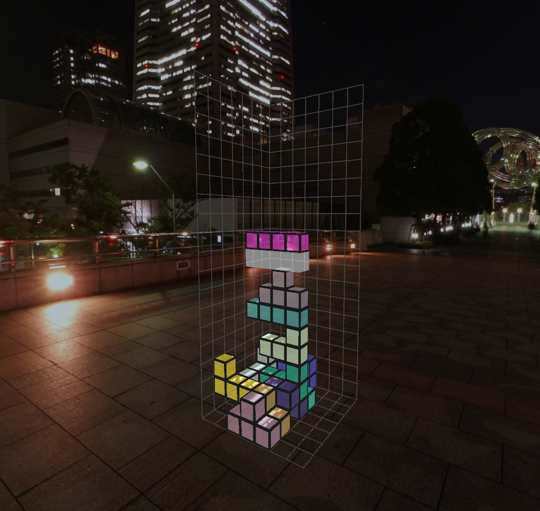

Tetris3d
===

A toy implementation of tetris 3D.

Requirements + my thoughts
------------

* random blocks are generated following the original tetris shapes

*This point was quite unclear. I was not sure if I should generate random blocks or just randomize the order. I decided to do second thing and use blocks listed here: [https://qph.fs.quoracdn.net/main-qimg-356e2b21c801381db2890dab49a9ea88](https://qph.fs.quoracdn.net/main-qimg-356e2b21c801381db2890dab49a9ea88)*
* the game area is a 10x10 space

*I found ~7x7 more enjoyable. 10x10 is quite a lot of space to play around.*
* when 1 layer is filled 100% the layer disappears

*In 3d tetris this happens so rarely...*  ;)
 * the height from which the blocks are falling is 50
  
*I found this requirement quite problematic. 50 is too much, it is very hard to track game with such tall playground. Maybe if a player does not rotate camera and looks down constantly - like in **Blockout** - it could be enjoyable. Otherwise I would suggest to make it shorter (~20)*
  * [speed requirements]
  
  *acceleration 25/s felt too slow with for playground 10x10x50; 2% speed increase each 10 seconds feels unnoticeable.*
 * [rotation requirements]
 
 *Making rotation behave naturally was interesting challenge. I chose discrete representation of playground area, so I was obliged to implemented discrete rotations; I chose simple representation for blocks to make fulfilling this requirement easier. I also implemented fixing out-of-bounds rotation when rotating the block which touches a wall or an obstacle. I noticed that some blocks do not rotate at all (O-block). Choosing continuous block state representation would make the problem much easier, but it would certainly come short in other areas (e.g. collisions)*
 * [missing translation requirement]
 
 *There was no translation requirement. How to play tetris without translating the pieces? ;) I have implemented additional translations (Q/E) to make the game playable.*
 * blocks should have different random colors
 
 *I have implemented this with simple rand() function, but I was not pleased with results. Random is usually not what people say when the are talking about random; if I had more time, I would reimplement it using bag (one or more) of colors shuffled constantly (after iterating all colors)*
 * bonus: camera rotations and zoom in/out
 
 *Implemented with additional axis restrictions; zooming implemented by adjusting fov; if i had more time I would filter input and made it more elastic;*
 * bonus: graphic boost
 
 *No much time left to do it unfortunately. I was not sure if I have time to work on advanced graphics, so I started implementing OpenGL 2.1 renderer and only after I did most of the work with more important requirements I switched to OpenGL 3.3 (I've reimplemented whole previous renderer in core profile); I have made environment mapping and skybox; I also added projected falling blocks to help with gameplay; and some small effects indicating pause/lost /score; one nice thing under the hood I achieved is making game logic separate from rendering, so switching renderers can be made with settings flag; still a lot of things to make here...*

Running
------------
I have compiled executable and linked statically with glfw and libstdc++ on Ubuntu 18.04 64bit. To lunch game simply:

* run `./tetris3d`
* make sure `data/` folder is in your working directory

No textures packed inside executable. Yet...

Compilation
-------------
    make

Futher improvements
-------------
* more strict tetris rules (e.g. SRS - https://tetris.fandom.com/wiki/SRS)
* game should be made playable by experimenting with different playground dimensions and adjusting game pace
* graphics: chosing theme would be a start, adjusting colors, postprocessing, etc.
* I would like to made it so when a layer disappers it throws all containing cubes in all directions; it would require some physics (https://www.youtube.com/watch?v=4vG13BwerJ4)
* filtered input, more fluent camera rotations
* sound
* tracking score (maybe globally?)
* proper background animations
* xray-ed falling blocks to reduce clutter; wireframe could be a start (depending on camera angle)
* gui with next few pieces pieces
* game save/load system
* cooperative tetris 3d - map is too large for one player, so maybe bring a friend!
* much, much more...
